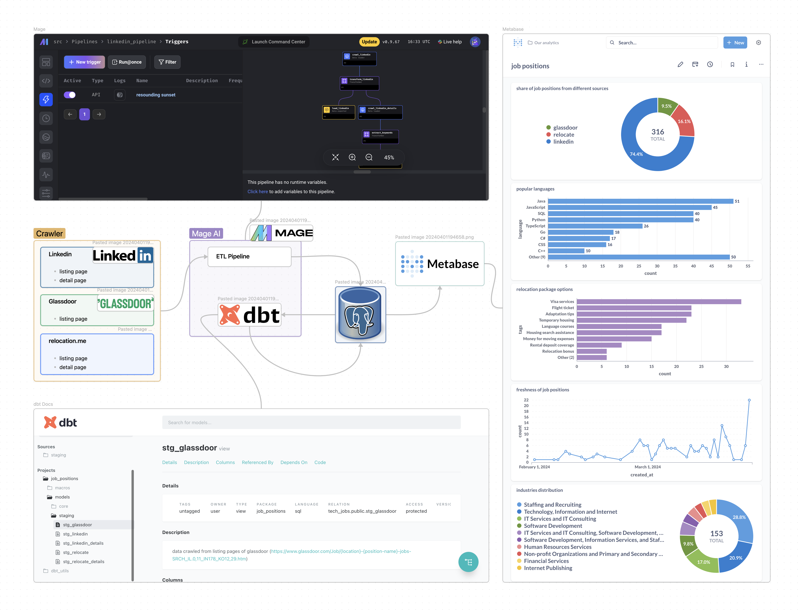
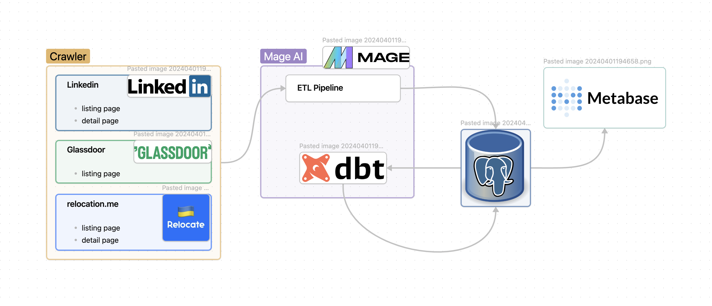

# Tech Career Explorer

In this data engineering project, I develop an end-to-end solution to find and analyse the current tech job positions from famous sites like [linkedin](https://www.linkedin.com/) and [glassdoor](glassdoor.com). I build a pipeline to crawl and extract job data from these sites, process and model the data before finally visualising the results in a metabase dashboard.
## Used Technologies
- Workflow orchestration: **Mage**
- Data Warehouse: **PostgreSQL** (for production DW), DuckDB (for develpment DW and backup)
- Batch processing: **DBT**
- Dashboard: **Metabase**

## Evaluation Criteria
### Problem description
In the current job market, it’s challenging to keep track of job postings across multiple platforms like LinkedIn and Glassdoor. The data is vast and scattered, making it difficult for job seekers and recruiters to make informed decisions. Moreover, the lack of a centralized system for storing and analyzing this data exacerbates the problem.

Project Structure: 


To address this issue, I have developed a data pipeline and dashboard. The project begins by crawling job position data from various platforms such as LinkedIn and Glassdoor. This data is then transformed and loaded into a data warehouse, providing a centralized storage solution for all the job data.

The project utilizes both ELT (Extract, Load, Transform) and ETL (Extract, Transform, Load) methodologies for data transformation. DBT (Data Build Tool) is used for performing transformations in the data warehouse, while Mage-AI is used for ETL processes, ensuring that the data is clean, reliable, and ready for analysis.

Finally, a dashboard is created using Metabase, providing a user-friendly interface for interacting with the data. This dashboard allows users to gain insights from the data.

This project effectively addresses the problem of scattered job data, providing a streamlined solution for job data extraction, transformation, loading, and analysis. It serves as a valuable tool for both job seekers and recruiters in the modern job market.

### Data ingestion (batch processing)


Firstly, the crawlers will scan the listing pages based on the input parameters (position name and job location). From these pages, the detail page URLs for each job position will be extracted. After a minor transformation and cleanup, the listing data will be exported to the data warehouse.

Simultaneously, another crawler will retrieve data from all the detail URLs obtained in the previous step. Once the job descriptions are obtained, a predefined list of keywords (which can be configured [here](./src/configs/keywords.yml)) will be scanned across the entire job detail page. If any of these keywords exist, they will be stored in a separate table in the data warehouse for further analytics.

### Transformations (dbt)


### Data warehouse

**PostgreSQL** serves as the data warehouse for this project. To ensure robustness, a daily job backs up data from the warehouse and stores it in DuckDB. To address scalability issues and optimize queries, we can employ partitioning, sharding, and clustering.

We have two final tables connected to our dashboard: `fact_positions` and `fact_metadata`. When handling partitioning and clustering, we must consider the types of queries performed on these tables.

`fact_metadata` Table:
- This table primarily contains valuable data for analytics.
- Queries are specific to its source, which includes data from LinkedIn, Glassdoor, and Relocate.
- Therefore, partitioning this table based on the source column is taken.

`fact_positions` Table:
- Unlike `fact_metadata`, this table does not contain source-specific data.
- For partitioning, using consistent hashing based on the position_id is being used.

### Dashboard


### Reproducibility
how to build:
1. clone this repo using the below command
```bash
git clone https://github.com/shayansm2/tech-career-explorer.git
```
2. build the project
go to the project folder
```bash
cd tech-career-explorer
```
add execution access to build file
```bash
chmod +x build.sh
```
start building
```bash
./build.sh
```
have in mind that you should have a running docker in your system for building this project.
3. now you can check the exported ports 

|link|purpose|
|---|---|
|[mage ai panel](http://localhost:6789/)| for checking and running pipelines |
|[dbt docs](http://localhost:8080/)| for checking dbt docs and lineage|
|[metaase dahsboard](http://localhost:3000/dashboard/1-job-positions)|for checking the dashboards|
|localhost:5432|connecting to the postgresql database|


board of this project and list of all todos:[link](https://github.com/users/shayansm2/projects/7/views/2)