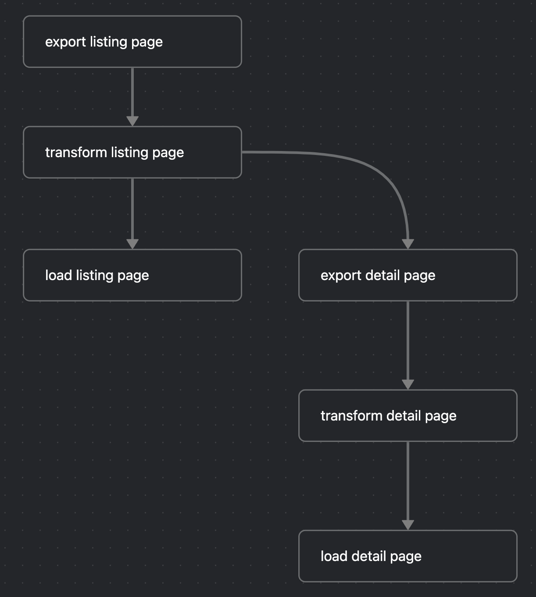

# tech-job-crawler

tools to use:
- postgres as data warehouse (production)
- duckdb as data warehouse (development)
- mage-ai as pipeline src
- DLT, DBT for ELT
- metabase for dashboard
<!-- - spark
- hamravesh or Arvan as cloud provider
- teraform  -->

## todos:
- [x] build
    - [x] build postgressql docker
    - [x] build mage-ai docker
    - [x] build metabase docker
    - [x] build.sh
- [x] simple pipeline
- [ ] multi crawler
    - [ ] ICrawler - Exporter
    - [x] https://relocate.me/ crawler
    - [ ] https://www.glassdoor.com/ crawler
    - [ ] https://siaexplains.github.io/visa-sponsorship-companies/ crawler
    - [x] https://www.linkedin.com/jobs/ crawler
- [ ] Detailed Page
    - [ ] Detailes of relocate and extract data from it
    - [ ] **Detailes of linkedin**
        - [ ] login page data (skills and company info)
        - [ ] text analysis (chat gpt api, optional requirement, different flow)

- [ ] crawler settings
    - [ ] preference, configs and filters panel ?
    - [ ] relocate filters
- [x] hash_id and update, replace
- [ ] db id for update not insert
- [ ] UI
    - [ ] **store dashboards**
    - [ ] panel for sertting values for positions (not_interested, interested, applied)
- [ ] dbt
    - [ ] join and one meta table
    - [ ] tables doc
    - [ ] tests

- [ ] kafka
    - [ ] event based for linkdin job alerts
- [ ] spark
    - [ ] batch processing of PDPs
- [ ] cloud deployment
- [x] github page
- [ ] explain the project in readme
- [ ] change the name from tech job crawler to tech career explorer

how to build:
1. docker clone
2. chmod +x build.sh
3. ./build.sh