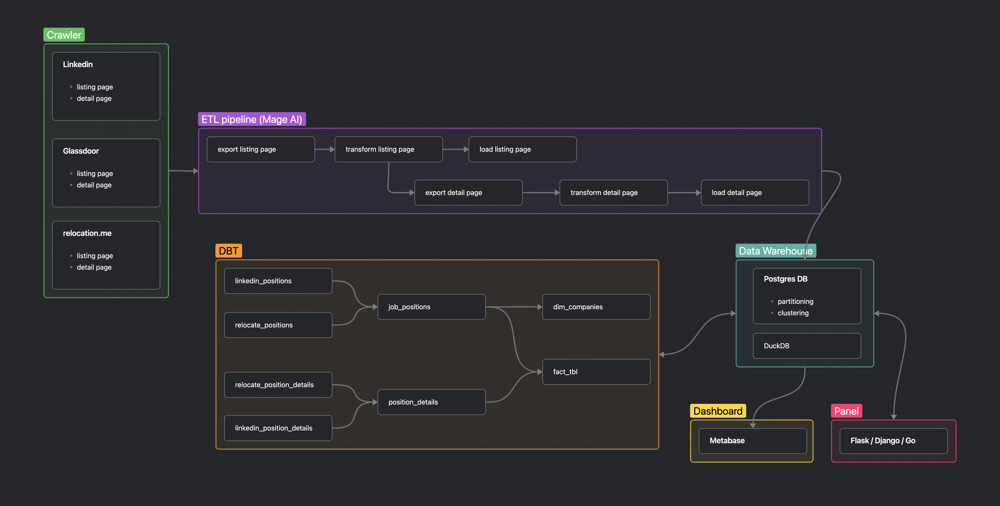

# tech-job-crawler

tools to use:
- postgres as data warehouse (production)
- duckdb as data warehouse (development)
- mage-ai as pipeline src
- DBT for ELT
- metabase for dashboard

## todos:
- [x] build
    - [x] build postgressql docker
    - [x] build mage-ai docker
    - [x] build metabase docker
    - [x] build.sh
- [x] simple pipeline
- [x] listing crawlers
    - [x] https://relocate.me/ crawler
    - [x] https://www.glassdoor.com/ crawler
    - [x] https://www.linkedin.com/jobs/ crawler
    - [x] linkedin retries
- [ ] Detailed Page
    - [ ] Details of relocate and extract data from it
    - [ ] detail page of glassdoor 
    - [x] Details of linkedin
- [ ] crawler settings
    - [x] preference, configs and filters panel ?
- [x] hash_id and update, replace
- [x] db id for update not insert
- [ ] dashboard
    - [x] store dashboards
    - [ ] handle listing with metabase model
    - [ ] handle setting flags with metabase actions (not_interested, interested, applied)
- [ ] dbt
    - [ ] join and one meta table
    - [ ] tables doc
    - [ ] tests
- [ ] cloud deployment
    - Hamravesh
    - Arvan
    - liara
- [x] github page
- [ ] explain the project in readme
- [ ] change the name from tech job crawler to tech career explorer
- [x] config handler
- [ ] DB backup
- [ ] scheduled pipeline runner

how to build:
1. docker clone
2. chmod +x build.sh
3. ./build.sh