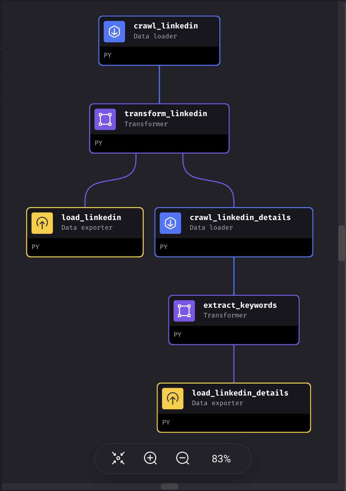
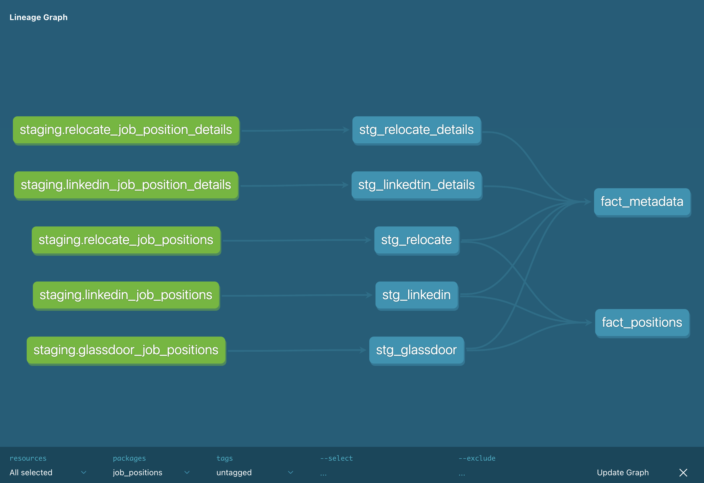
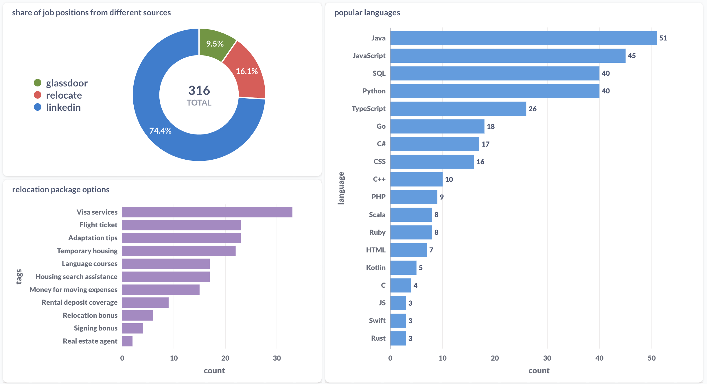
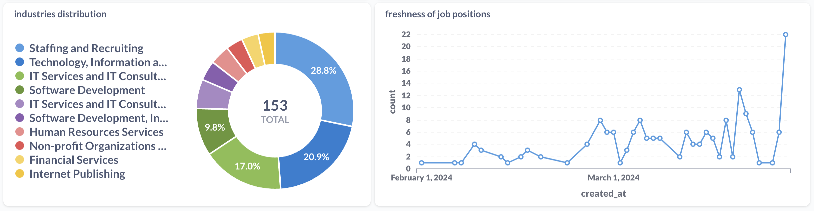

# Tech Career Explorer

## Used Technologies
- Workflow orchestration: Mage
- Data Warehouse: PostgreSQL (for production DW), DuckDB (for develpment DW and backup)
- Batch processing: DBT
- Dashboard: Metabase

## Project Structure

## Dashboard
## Evaluation Criteria
### Problem description
### Data ingestion (batch processing)

### Data warehouse
### Transformations (dbt)

### Dashboard

### Reproducibility
how to build:
1. docker clone
2. chmod +x build.sh
3. ./build.sh
4. dev mode
5. add extension
### Cloud deployment

board of this project and list of all todos:[link](https://github.com/users/shayansm2/projects/7/views/2)